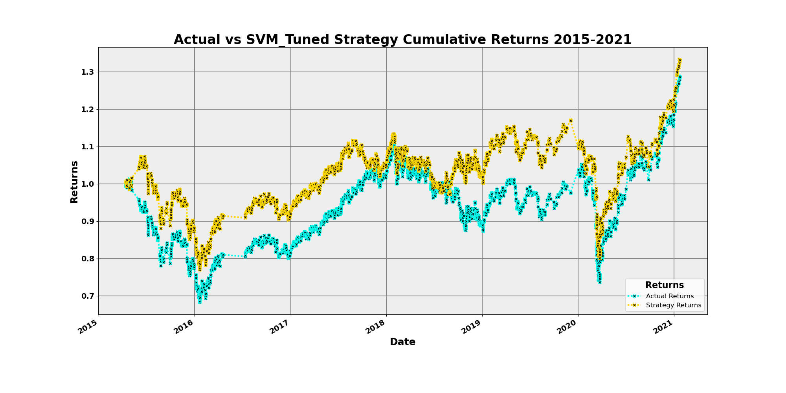
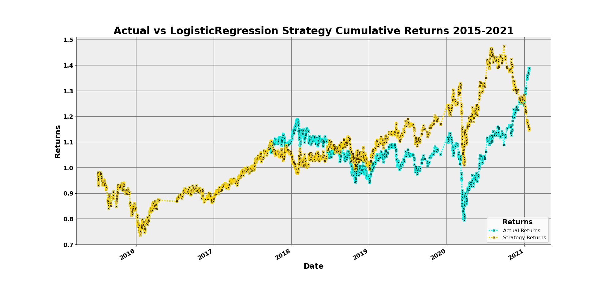

# Machine Learning Trading Bot

In this Challenge, you’ll assume the role of a financial advisor at one of the top five financial advisory firms in the world. Your firm constantly competes with the other major firms to manage and automatically trade assets in a highly dynamic environment. In recent years, your firm has heavily profited by using computer algorithms that can buy and sell faster than human traders.

The speed of these transactions gave your firm a competitive advantage early on. But, people still need to specifically program these systems, which limits their ability to adapt to new data. You’re thus planning to improve the existing algorithmic trading systems and maintain the firm’s competitive advantage in the market. To do so, you’ll enhance the existing trading signals with machine learning algorithms that can adapt to new data.

## Baseline Algorithm

### Performance Conclusions

From 2015 through mid/late 2017 the strategy returns for the baseline algorithm performed the same as the actual returns. From mid/late 2017 through mid-2018 the strategy returns for the baseline algorithm performed worse than the actual returns. And from mid-2018 through 2021 the strategy returns of the baseline algorithm performed better than that of the actual returns. From this we can conclude that although the baseline algorithms strategy returns did perform better than that of the actual returns for almost three years, since the baseline algorithms strategy returns were worse or equal to that of the actual returns for the vast majority of the timeframe, we can conclude that the baseline algorithm did not perform well and instead has a lot of work to be done to improve it.

## Training-Window Tuning

### Performance Conclusions

The change made to the training window was to decrease the offset from 3 months to 1 month. The resulting impact of decreasing the training window from 3 months to 1 month was that the strategy performed better than both the actual returns as well as the original strategy returns. This trend of performing better than both the actual returns and the original strategy returns of the original baseline algorithm can be seen throughout the entire timeframe (2015-2021). Due to the exceptional performance of this tuned algorithm we can conclude that there may be some room for improvement, but we have a solid algorithm that has high performance.

## SMA-Window Tuning

### Performance Conclusions

The change made to the SMA window was to decrease the SMA Slow/long window, slightly, from 100 to 95. The resulting impact of a slight decrease from 100 to 95 for SMA Slow/long window was that the strategy performed better than both the actual returns as well as the original strategy returns. From 2015 through mid/late 2017 the strategy returns for the SMA-Window Tuning algorithm performed the same as the actual returns. From mid/late 2017 through mid-2018 the strategy returns for the SMA-Window Tuning algorithm performed worse than the actual returns. And from mid-2018 through 2021 the strategy returns of the baseline algorithm performed better than that of the actual returns. From this we can conclude that although the SMA-Window Tuning algorithms strategy returns did perform better than that of the actual returns for almost three years, since the SMA-Window Tuning algorithms strategy returns were worse or equal to that of the actual returns for the vast majority of the timeframe, we can conclude that the SMA-Window Tuning algorithm did not perform well and instead has a lot of work to be done to improve it.

## Tuned

### Performance Conclusions

For the final tuned algorithm we are using a training window decreased from three months to one month. Beyond this the SMA Fast/short window was increased from 4 to 30 and the SMA Slow/long window was decreased from 100 to 60. The result of these changes is that we have the best performance seen of any algorithm. This tuning beats the original baseline algorithm, the algorithm with training-window tuning, the algorithm with SMA-Window tuning and the actual returns. The trend of performing better than each of the other algorithms and the actual returns is seen throughout the entire timeframe (2015-2021) except for a short period in mid-2018 when the tuned algorithm performes worse than teh training-window tuned algorithm. We can conclude that since these are the best results we have seen for any of the algorithms that there is not much room left for improvement and this is the ideal algorithm. Though, since there was a minor period in mid-2018 where the training-window tuning algorithm outperformed the final tuned algorithm, there is still a minor need for improvement.

## Logistic Regression

### Performance Conclusions

The new logistic regression strategy performed worse from late 2017 through mid-2018 than the baseline model, but from mid-2019 through late 2020 the logistic regression model performed better than the baseline model. And finally from late 2020 through 20201 the logistic regression performed worse than the baseline algorithm. The new logistic regression model performed worse than the tuned model from 2015 through late 2020. Though for a short period in mid-2018 the logistic regression strategy performed better the tuned model. Then after mid-2018 through late 2019 the logistic regression model performed worse than the tuned model. Then from late 2019 through late 2020 the logistic regression model performed better than the tuned model. And finally from late 2020 through 2021 the logistic regression performed worse than the tuned algorithm.

## Summary Evaluation Report

From 2015 through mid/late 2017 the baseline algorithm, SMA-window tuning algorithm and the logistic regression algorithm all had the same performance, which was also the same as the performance of the actual returns. During this same period the tuned and training tuning algorithms both outperformed these algorithms and the actual returns, but the tuned algorithm saw the highest performance during this period. Then again from mid/late 2017 thorugh mid-2018 the training tuning algorithm and the tuned algorithm both outperformed the other algorithms and the actual returns, but the baseline, SMA-window and logistic regression all underperformed agains the actual returns. Then in mid-2018 the baseline algorithm, the tuned algorithm and the SMA-window tuning algorithms all underperformed against the actual returns while the logistic regression and training tuning algorithms autperformed the actual returns. After that all of the algorithms outperformed the actual returns, until late 2020 when the logistic regression underperformed agains the actual returns as well as the other models. Though during the period from mid-2018 through late 2019 we can see that the SVM algorithms all outperformed the logistic regression algorithm, but from late 2019 through late 2020 the logistic regression algorithm performed the best, until it underperformed all of the algoirthms and the actual returns in late 2020 through 2021. From these results we can conclude two things. Firstly, that for the vast majority of the time the tuned algorithm with a training window shortened from three months to one month, an SMA Fast/short window increased to 30 from 4 and an SMA Slow/long window decreased from 100 to sixty gives us the best performance, though the logistic regression algorithm performs the best from late 2019 through late 2020. Due to these conclusions it is recommended to use a custom ensamble of the tuned algorithm as well as the logistic regression algorithm, drawing on the long breadth of strength that the tuned algorithm showed as well as the peak performance of the logistic regression late in the timeframe.

